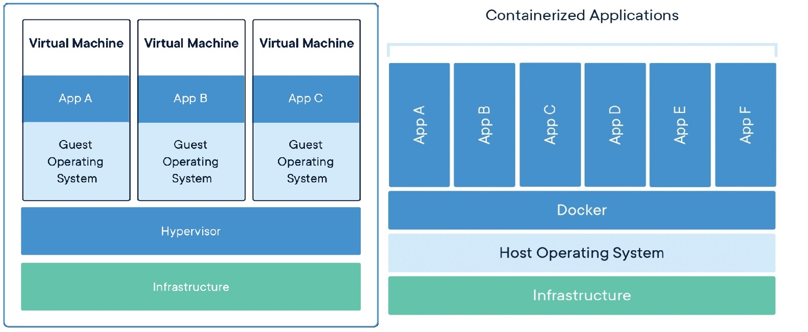

### Conteneurs

Les **conteneurs** sont comme des machines virtuelles très légères qui peuvent **s’exécuter directement sur le noyau du système d’exploitation hôte sans nécessiter d’hyperviseur**. 
Par conséquent, nous pouvons exécuter plusieurs conteneurs simultanément.

Ainsi, bien que les conteneurs puissent donner l’illusion d’un système d’exploitation léger en raison de leur isolation et de leur nature autonome, **ils ne contiennent pas réellement un noyau de système d’exploitation séparé** comme le ferait une machine virtuelle. 

Ils utilisent le noyau de l’hôte et **incluent simplement l’application et ses dépendances immédiates, ce qui peut comprendre des bibliothèques, binaires, etc.**, nécessaires à l’exécution de l’application.

Chaque **conteneur contient une application avec toutes ses dépendances et est isolé des autres**. Les développeurs peuvent échanger ces conteneurs sous forme d’image(s) via un **registre** et peuvent également les déployer directement sur des serveurs.


### Comparaison entre machines virtuelles et conteneurs



**Machines virtuelles :**

* Une machine virtuelle est l’équivalent émulé d’un système informatique physique avec son CPU virtuel, sa mémoire, son stockage et son système d’exploitation.
* Un programme appelé hyperviseur crée et exécute des machines virtuelles. L’ordinateur physique exécutant un hyperviseur est appelé système hôte, tandis que les machines virtuelles sont appelées systèmes invités.
* L’hyperviseur traite les ressources — comme le CPU, la mémoire et le stockage — comme un pool pouvant être facilement réalloué entre les machines virtuelles invitées existantes.

**Conteneurs :**

* Un conteneur est une abstraction au niveau de la couche application qui regroupe le code et ses dépendances.
* Au lieu de virtualiser la machine physique entière, les conteneurs virtualisent uniquement le système d’exploitation de l’hôte.
* Les conteneurs s’exécutent au-dessus de la machine physique et de son système d’exploitation. Chaque conteneur partage le noyau du système d’exploitation hôte et, généralement, les binaires et bibliothèques également.

| Quelles différences ? | VMs | Conteneurs |
| :--- | :--- | :--- |
| taille | Lourd \(Goctets\) | Léger \(Moctets\) |
| BootTime | Démarrage en minutes | Démarrage en secondes |
| Performance | Performance limitée | Performance native |
| OS | Chaque VM fonctionne avec son propre OS | Tous les conteneurs partagent l’OS hôte |
| Fonctionne sur | Virtualisation au niveau matériel \(Type1\) | Virtualisation de l’OS |
| Mémoire | Alloue la mémoire requise | Nécessite moins d’espace mémoire |
| Isolation | Entièrement isolé et donc plus sécurisé | Isolation au niveau des processus, potentiellement moins sécurisé |

### Docker

Docker est une plateforme de conteneurisation open source. Elle fournit la capacité d’exécuter des applications dans un environnement isolé appelé conteneur.

#### Docker Hub

)

Le **Docker Hub** est un référentiel public maintenu par Docker Inc.

**https://hub.docker.com/**

Il contient un grand nombre **d’images** (officielles ou non) qui peuvent être téléchargées pour instancier des conteneurs

- Nginx, Redis, MariaDB, Wordpress,…

Il est possible de créer un compte :

- Pour publier des images dans le référentiel public

- Pour créer un référentiel privé avec des images privées

#### Docker Engine

Pour comprendre ce qui vient de se passer, il faut se familiariser avec l’architecture Docker, les images, les conteneurs, et les registres.

Docker Engine est une application client-serveur composée des éléments principaux suivants :
- Un **serveur** qui est un type de programme de longue durée appelé processus démon (la commande dockerd).
- Une **API REST** qui spécifie les interfaces que les programmes peuvent utiliser pour communiquer avec le démon et lui indiquer quoi faire.
- Un **client en ligne de commande (CLI)** (la commande docker).

)

#### Architecture Docker

L’architecture de Docker est également basée sur un modèle client-serveur. 
Cependant, elle est un peu plus complexe qu’une machine virtuelle en raison des fonctionnalités impliquées. 
Elle se compose de quatre parties principales :


1. **Client Docker** : C’est ainsi que vous interagissez avec vos conteneurs. On peut l’appeler l’interface utilisateur de Docker.
2. **Objets Docker** : Ce sont les composants principaux de Docker : vos conteneurs et images. Nous avons déjà mentionné que les conteneurs sont les espaces pour vos logiciels et peuvent être lus et écrits. Les images de conteneur sont en lecture seule et utilisées pour créer de nouveaux conteneurs.
3. **Démon Docker** : Un processus en arrière-plan chargé de recevoir les commandes et de les transmettre aux conteneurs via la ligne de commande.
4. **Registre Docker** : Communément appelé Docker Hub, c’est là où vos images de conteneur sont stockées et récupérées.

### Installation de Docker

#### Red Hat , Fedora, Centos, AlmaLinux, Rocky Linux, Oracle Linux

**CONFIGURER LE RÉFÉRENTIEL**

Avant d’installer Docker Engine pour la première fois sur une nouvelle machine hôte, vous devez configurer le référentiel Docker. Ensuite, vous pourrez installer et mettre à jour Docker à partir du référentiel.

```yaml
$ sudo dnf install -y epel-release
$ sudo dnf config-manager --add-repo https://download.docker.com/linux/centos/docker-ce.repo
```

**INSTALLER DOCKER ENGINE**

Installez la _dernière version_ de Docker Engine et containerd, ou passez à l’étape suivante pour installer une version spécifique :

```yaml
$ sudo dnf -y update
$ sudo dnf install -y docker-ce
```

**DÉMARRER DOCKER**

```yaml
$ sudo systemctl enable --now docker
```
#### Debian, Ubuntu, Kali

**INSTALLER DOCKER ENGINE & DOCKER-COMPOSE**

Mettez à jour l’index du paquet `apt`, et installez la _dernière version_ de Docker Engine, ou passez à l’étape suivante pour installer une version spécifique :

```yaml
 $ sudo apt update
 $ sudo apt install -y docker.io
 $ sudo systemctl enable --now docker
```

### Windows 10/11

Les étapes d’installation sont les suivantes :

1- Allez sur ce site : https://learn.microsoft.com/en-us/windows/wsl/install et suivez les instructions pour installer **WSL2** sur Windows 10.

2- Puis allez sur la page officielle de téléchargement https://www.docker.com/products/docker-desktop/ et cliquez sur le bouton Download for Windows (stable) 

3- Double-cliquez sur l’installateur téléchargé et suivez l’installation avec les paramètres par défaut.

Une fois l’installation terminée, démarrez ***Docker Desktop*** soit depuis le menu démarrer soit depuis votre bureau. L’icône Docker doit apparaître dans votre barre des tâches.

)

Maintenant, ouvrez Ubuntu ou toute autre distribution que vous avez installée depuis le Microsoft Store. 
Exécutez les commandes **docker --version** pour vérifier que l’installation a réussi.

)

### Hello World dans Docker

Maintenant que Docker est prêt sur nos machines, il est temps d’exécuter notre premier conteneur. Ouvrez un terminal et exécutez la commande suivante :

```yaml
$ sudo docker run hello-world
```
Si tout se passe bien, vous devriez voir une sortie similaire à celle-ci :

```yaml
[root@earth]# docker run hello-world
Unable to find image 'hello-world:latest' locally
latest: Pulling from library/hello-world
0e03bdcc26d7: Pull complete 
Digest: sha256:49a1c8800c94df04e9658809b006fd8a686cab8028d33cfba2cc049724254202
Status: Downloaded newer image for hello-world:latest

Hello from Docker!
This message shows that your installation appears to be working correctly.

To generate this message, Docker took the following steps:
 1. The Docker client contacted the Docker daemon.
 2. The Docker daemon pulled the "hello-world" image from the Docker Hub.
    (amd64)
 3. The Docker daemon created a new container from that image which runs the
    executable that produces the output you are currently reading.
 4. The Docker daemon streamed that output to the Docker client, which sent it
    to your terminal.

To try something more ambitious, you can run an Ubuntu container with:
 $ docker run -it ubuntu bash

Share images, automate workflows, and more with a free Docker ID:
 https://hub.docker.com/

For more examples and ideas, visit:
 https://docs.docker.com/get-started/

```
--------
Ressources:

[https://www.docker.com/resources/what-container](https://www.docker.com/resources/what-container)

[https://www.backblaze.com/blog/vm-vs-containers/](https://www.backblaze.com/blog/vm-vs-containers/)

[https://cloudacademy.com/blog/docker-vs-virtual-machines-differences-you-should-know/](https://cloudacademy.com/blog/docker-vs-virtual-machines-differences-you-should-know/)

[https://docs.docker.com/get-started/overview/](https://docs.docker.com/get-started/overview/)

[https://docs.docker.com/engine/install/fedora/](https://docs.docker.com/engine/install/fedora/)

[https://docs.docker.com/engine/install/centos/](https://docs.docker.com/engine/install/centos/)

[https://docs.docker.com/engine/install/ubuntu/](https://docs.docker.com/engine/install/ubuntu/)


