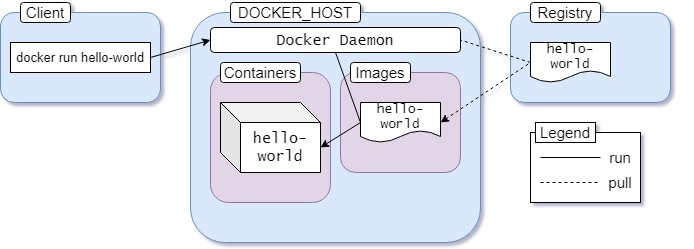

## Docker **Images**

Une **image** est un modèle en lecture seule contenant des instructions pour créer un conteneur Docker. 

## Registre Docker

Un **registre Docker** stocke les images Docker. **Docker Hub** est un registre public que tout le monde peut utiliser, et Docker est configuré pour rechercher des images sur Docker Hub par défaut. Vous pouvez même exécuter votre propre registre privé.

Lorsque vous utilisez les commandes `docker pull` ou `docker run`, les images nécessaires sont récupérées à partir de votre registre configuré. Lorsque vous utilisez la commande `docker push`, votre image est envoyée vers votre registre configuré.

#### Vue d’ensemble complète

Maintenant que vous êtes familier avec l’architecture, les images, les conteneurs et les registres, vous êtes prêt à comprendre ce qui se passe lorsque nous exécutons la commande `docker run hello-world`.

L’image [hello-world](https://hub.docker.com/_/hello-world) est un exemple de conteneurisation minimale avec Docker. Elle contient un seul fichier [hello.c](https://github.com/docker-library/hello-world/blob/master/hello.c) responsable d’afficher le message que vous voyez sur votre terminal. Presque toutes les images contiennent une commande par défaut. Dans le cas de l’image hello-world, la commande par défaut est d’exécuter le binaire _hello_ compilé à partir du code C mentionné précédemment.

Une représentation graphique du processus est la suivante :



L’ensemble du processus se déroule en cinq étapes :

1. Nous exécutons la commande `docker run hello-world`. 
2. Le client Docker indique au démon que nous voulons exécuter un conteneur à l’aide de l’image hello-world. 
3. Le démon Docker télécharge la dernière version de l’image à partir du registre. 
4. Crée un conteneur à partir de l’image. 
5. Exécute le conteneur nouvellement créé.

C’est le comportement par défaut du démon Docker de rechercher dans le hub les images qui ne sont pas présentes localement. Mais une fois qu’une image a été récupérée, elle reste dans le cache local. Ainsi, si vous exécutez la commande à nouveau, vous ne verrez pas les lignes suivantes dans la sortie :

```yaml
[root@earth]# docker run hello-world
Unable to find image 'hello-world:latest' locally
latest: Pulling from library/hello-world
0e03bdcc26d7: Pull complete 
Digest: sha256:49a1c8800c94df04e9658809b006fd8a686cab8028d33cfba2cc049724254202
Status: Downloaded newer image for hello-world:latest
```

S’il existe une version plus récente de l’image, le démon téléchargera à nouveau l’image. Le `:latest` est une étiquette (tag). Les images ont généralement des étiquettes significatives pour indiquer les versions ou les builds. Vous en apprendrez davantage à ce sujet dans une section ultérieure.

## Manipulation des conteneurs

Dans la section précédente, nous avons eu une introduction sur le client Docker. Comme mentionné, il s’agit du programme CLI (interface en ligne de commande) qui envoie nos commandes au démon Docker. Maintenant, vous allez apprendre des méthodes plus avancées pour manipuler les conteneurs dans Docker.

### Exécution des conteneurs

Dans la section précédente, nous avons utilisé `docker run` pour **créer** et **exécuter** un conteneur à partir de l’image hello-world. La syntaxe générique de cette commande est :

```yaml
docker run <nom de l’image>
```

Ici, `<nom de l’image>` peut être n’importe quelle image provenant de Docker Hub ou de notre machine locale. Remarquez que nous disons créer et exécuter et non juste exécuter, car la commande `docker run` effectue en réalité le travail de deux commandes distinctes :

1. `docker create <nom de l’image>` crée un conteneur à partir de l’image donnée et renvoie l’ID du conteneur. 
2. `docker start <id du conteneur>` démarre un conteneur en utilisant l’ID d’un conteneur déjà créé.

Pour créer un conteneur à partir de l’image hello-world, exécutez la commande suivante :

```yaml
[root@earth ~]# docker create hello-world
c41d97e867380b372f56d4801e9e83b2b528da17792c390b4825bbb2289f9bcf
```

La commande renverra une longue chaîne, c’est l’ID du conteneur. Cet ID peut être utilisé pour démarrer le conteneur construit.

> Les 3 ou 4 premiers caractères de l’ID du conteneur suffisent pour identifier le conteneur. Par exemple, utiliser `c41d97e867` est suffisant.

Pour démarrer ce conteneur, exécutez la commande suivante :

```yaml
[root@earth ~]# docker start c41d97e867 
c41d97e867 
```

### Lister les conteneurs

Pour voir la liste des conteneurs en cours d’exécution, utilisez la commande `docker ps` :

```yaml
[root@earth ~]# docker ps
CONTAINER ID        IMAGE               COMMAND             CREATED             STATUS              PORTS               NAMES
```

Vous verrez que le conteneur s’est exécuté et a quitté avec succès ! Pourquoi ?

> Contrairement aux machines virtuelles, les conteneurs ne sont pas conçus pour héberger un système d’exploitation, ils sont destinés à exécuter une tâche ou un processus spécifique. Une fois la tâche terminée, le conteneur s’arrête.
>
> **"Un conteneur ne vit que tant que le processus à l’intérieur est vivant."**

Dans notre exemple hello-world, le conteneur s’arrête dès que le fichier [hello.c](https://github.com/docker-library/hello-world/blob/master/hello.c) a affiché le message.

L’option `-a` ou `--all` indique que nous voulons voir non seulement les conteneurs en cours d’exécution, mais aussi ceux arrêtés. Exécuter ps sans l’option -a listera uniquement les conteneurs actifs.

```yaml
[root@earth ~]# docker ps -a
CONTAINER ID        IMAGE               COMMAND             CREATED             STATUS                      PORTS               NAMES
c41d97e86738        hello-world         "/hello"            About an hour ago   Exited (0) 10 minutes ago                       flamboyant_allen
```

### Redémarrage des conteneurs

Nous avons déjà utilisé la commande `start` pour exécuter un conteneur. Il existe une autre commande appelée `restart`. La différence est que `restart` arrête un conteneur en cours et le redémarre, tandis que `start` ne démarre que les conteneurs arrêtés.

### Nettoyer les conteneurs inutiles

Les conteneurs arrêtés restent dans le système. Ces conteneurs « pendants » prennent de l’espace et peuvent poser problème plus tard. Pour les supprimer, utilisez :

```yaml
docker rm <id du conteneur>
```

### Exécution en mode interactif

Nous avons jusqu’à présent exécuté des conteneurs simples. Pour des systèmes complets comme Ubuntu, on utilise `-it` pour un mode interactif :

```yaml
[root@earth ~]# docker run -it ubuntu
root@1f2229e0a867:/#
```

Nous devrions arriver directement dans bash à l’intérieur du conteneur Ubuntu. Dans cette fenêtre bash, nous pourrons effectuer des tâches que nous faisons habituellement dans un terminal Ubuntu classique :

```yaml
root@1f2229e0a867:/# cat /etc/os-release 
NAME="Ubuntu"
VERSION="20.04 LTS (Focal Fossa)"
ID=ubuntu
ID_LIKE=debian
PRETTY_NAME="Ubuntu 20.04 LTS"
VERSION_ID="20.04"
HOME_URL="https://www.ubuntu.com/"
SUPPORT_URL="https://help.ubuntu.com/"
BUG_REPORT_URL="https://bugs.launchpad.net/ubuntu/"
PRIVACY_POLICY_URL="https://www.ubuntu.com/legal/terms-and-policies/privacy-policy"
VERSION_CODENAME=focal
UBUNTU_CODENAME=focal
```

La raison derrière la nécessité de l’option `-it` est que l’image Ubuntu est configurée pour démarrer bash au lancement. Bash est un programme interactif : cela signifie que si nous ne tapons aucune commande, bash ne fera rien.

Pour interagir avec un programme à l’intérieur d’un conteneur, nous devons indiquer explicitement au conteneur que nous voulons une session interactive.

L’option `-it` nous permet d’interagir avec tout programme interactif à l’intérieur d’un conteneur. Cette option est en réalité deux options séparées combinées.

* L’option `-i` nous connecte au flux d’entrée du conteneur, afin que nous puissions envoyer des commandes à bash. 
* L’option `-t` garantit que nous obtenons un bon formatage et une expérience de terminal native. 

Nous devons utiliser l’option -it chaque fois que nous voulons exécuter un conteneur en mode interactif.

>Nous ne pouvons pas exécuter n’importe quel conteneur en mode interactif. Pour être éligible, le conteneur doit être configuré pour démarrer un programme interactif au lancement. Les shells, REPLs, CLIs, etc., sont des exemples de programmes interactifs.

> Pour quitter, utilisez ctrl+c ou fermez le terminal et le conteneur sera arrêté.

#### Ajouter une commande

Parfois, nous devons exécuter un conteneur et en même temps ajouter une commande à l’intérieur. Par exemple, pour voir une liste de tous les répertoires à l’intérieur du conteneur Ubuntu, vous pouvez passer la commande ls comme argument :

```yaml
[root@earth ~]# docker run ubuntu ls
bin
boot
dev
etc
home
lib
lib32
lib64
libx32
media
mnt
opt
proc
root
run
sbin
srv
sys
tmp
usr
var
```

Remarquez que nous n’utilisons pas l’option -it, car nous ne voulons pas interagir avec bash, nous voulons juste la sortie. Nous pouvons passer toute commande bash valide comme argument. Par exemple, passer la commande pwd retournera le répertoire de travail actuel.

> La liste des arguments valides dépend généralement du programme point d’entrée lui-même. Si le conteneur utilise le shell comme point d’entrée, toute commande shell valide peut être passée en argument. Si le conteneur utilise un autre programme comme point d’entrée, les arguments valides pour ce programme particulier peuvent être passés.

### Exécution des conteneurs en mode détaché

Pour garder le conteneur en cours d’exécution, vous devez garder la fenêtre du terminal ouverte (ce qui est peu pratique).

Vous pouvez exécuter ce type de conteneur en mode détaché. Les conteneurs en mode détaché s’exécutent en arrière-plan comme un service. Pour détacher un conteneur, nous pouvons utiliser l’option `-d` ou `--detach`. Pour exécuter le conteneur en mode détaché, exécutez la commande suivante :

```yaml
docker run -d redis 
```

Vous devriez obtenir l’ID du conteneur en sortie.

### Exécuter des commandes dans un conteneur en cours d’exécution

Maintenant que vous avez un serveur Redis fonctionnant en arrière-plan, supposons que vous vouliez effectuer des opérations en utilisant l’outil redis-cli. Vous ne pouvez pas simplement exécuter `docker run redis redis-cli`. Le conteneur est déjà en cours.

Pour ces situations, il existe une commande appelée exec permettant d’exécuter d’autres commandes dans un conteneur en cours d’exécution. La syntaxe générique est la suivante :

```yaml
docker exec <id du conteneur> <commande>
```

Si l’ID du conteneur Redis est 970f1a18714a, la commande sera la suivante :

```yaml
[root@earth]# docker exec -it 970f1a18714a redis-cli 
127.0.0.1:6379>
```

Remarquez que nous utilisons l’option `-it` car il s’agit d’une session interactive. Vous pouvez maintenant exécuter toute commande Redis valide dans cette fenêtre et les données seront conservées sur le serveur.

> Vous pouvez quitter simplement en appuyant sur la combinaison ctrl+p + ctrl+q ou en fermant la fenêtre du terminal. Le serveur continuera à fonctionner en arrière-plan même si vous quittez le programme CLI.

>**Démarrer un shell dans un conteneur en cours d’exécution**
>
>Si vous souhaitez utiliser le shell à l’intérieur d’un conteneur en cours d’exécution, vous pouvez le faire avec la commande `exec` et `sh` comme exécutable :
>
>```
>docker exec -it <id du conteneur> sh
>```

### Arrêter ou tuer un conteneur en cours d’exécution 

Les conteneurs en avant-plan peuvent être arrêtés en fermant simplement la fenêtre du terminal ou en appuyant sur ctrl + c. Les conteneurs en arrière-plan, cependant, ne peuvent pas être arrêtés de la même manière.

Il existe deux commandes pour arrêter un conteneur en cours d’exécution :

* `docker stop <id du conteneur>` tente d’arrêter le conteneur proprement en envoyant un signal SIGTERM. Si le conteneur ne s’arrête pas dans un délai de grâce, un signal SIGKILL est envoyé. 
* `docker kill <id du conteneur>` arrête immédiatement le conteneur en envoyant un signal SIGKILL. Un signal SIGKILL ne peut pas être ignoré.

Pour arrêter un conteneur avec l’ID `bb7fadc33178`, exécutez `docker stop bb7fadc33178`. En utilisant `docker kill bb7fadc33178`, le conteneur sera terminé immédiatement sans possibilité de nettoyage.

>Si vous voulez sortir d’un conteneur sans le tuer, tapez `Ctrl + p` puis `Ctrl + q`.

### Accéder aux logs d’un conteneur en cours d’exécution

Nous pouvons aussi utiliser la commande `logs` pour récupérer les logs d’un conteneur en cours d’exécution. La syntaxe générique est :

```yaml
docker logs <id du conteneur>
```

Par exemple, si l’ID de notre conteneur Redis est `970f1a18714a`, pour accéder aux logs :

```yaml
[root@earth]# docker logs 970f1a18714a
1:C 22 Jul 2020 11:32:40.404 # oO0OoO0OoO0Oo Redis is starting oO0OoO0OoO0Oo
1:C 22 Jul 2020 11:32:40.404 # Redis version=6.0.6, bits=64, commit=00000000, modified=0, pid=1, just started
...
```

Ceci est juste une portion de la sortie des logs. Nous pouvons obtenir les logs en temps réel en utilisant l’option `-f` ou `--follow`. Tout log ultérieur apparaîtra instantanément dans le terminal. Nous pouvons quitter en appuyant sur `ctrl+c` ou en fermant la fenêtre. Le conteneur continuera de fonctionner même après la sortie de la fenêtre des logs.
