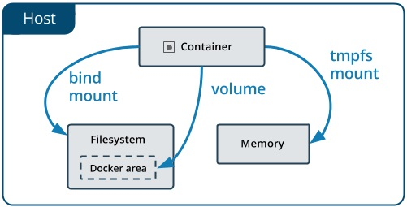
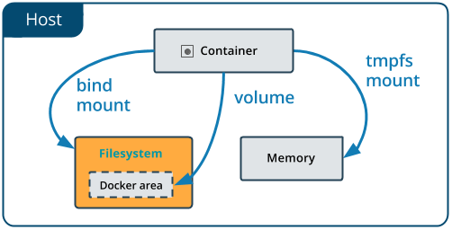
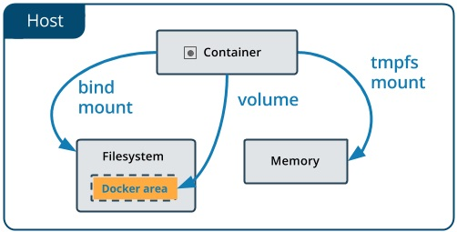

Les conteneurs Docker exécutent vos applications, ces applications ont besoin de données et ces données doivent être stockées quelque part. En tant qu’administrateur Docker, vous devez savoir gérer le stockage et les volumes Docker.

## Gestion des données dans Docker

Par défaut, tous les fichiers créés à l’intérieur d’un conteneur sont stockés sur une couche inscriptible du conteneur, mais les données ne doivent pas être stockées dans le conteneur ! car cela pose certains problèmes :

* Les conteneurs sont conçus pour être éphémères (jetables)
* Lorsque les conteneurs sont arrêtés, les données ne sont pas accessibles.
* Les conteneurs sont généralement stockés sur chaque hôte
* Le système de fichiers du conteneur n’a pas été conçu pour des E/S à haute performance.

Docker propose plusieurs options pour que les conteneurs stockent des fichiers sur la machine hôte, afin que les fichiers soient persistants même après l’arrêt du conteneur.

1. **Volumes Bind mount** : Consiste à monter un répertoire ou fichier de l’hôte dans le conteneur. La source doit être un chemin absolu existant sur votre machine hôte (par ex. /home/user/data).
2. **Volumes nommés** : Les volumes nommés sont gérés entièrement par Docker. Vous leur donnez un nom explicite et Docker stocke leurs données dans un emplacement interne : `/var/lib/docker/volumes/`
3. **Volumes anonymes** : Créés automatiquement par Docker lorsqu’aucun nom n’est spécifié dans la source.
4. **Volumes tmpfs mount** : Stocké uniquement dans la mémoire de l’hôte sous Linux.



### 1- Volumes Bind mounts

Les **Volumes bind mounts** sont un des types de volumes que vous pouvez utiliser dans Docker pour partager des données entre votre système hôte et vos conteneurs. Ils permettent de monter un répertoire ou un fichier spécifique du système de fichiers de l’hôte dans un conteneur.

Le fichier ou le répertoire n’a pas besoin d’exister sur l’hôte Docker. Les bind mounts sont très performants, mais ils dépendent de la structure des répertoires disponible sur le système de fichiers de l’hôte.



```yaml
# Créer un répertoire local /rep
[root@earth]# mkdir /rep
[root@earth]# cd /rep

# Ajouter des fichiers dans ce répertoire /rep pour tester
[root@earth rep]# touch source-code1.txt
[root@earth rep]# ls 
source-code1.txt

# Démarrer un conteneur ubuntu en attachant le nouveau bind mount /rep
[root@earth rep]#  docker run --rm -it --name ubuntu1 -v /rep:/rep1 ubuntu
root@b853101f43ba:/# cd /rep1
root@b853101f43ba:/rep1# ls
source-code1.txt
root@b853101f43ba:/rep1# touch source-code2.txt
root@b853101f43ba:/rep1# ls
source-code1.txt source-code2.txt
root@b853101f43ba:/rep1# exit

# Vérifiez si les fichiers créés dans le conteneur existent dans le répertoire local
[root@earth rep]# ls
source-code1.txt source-code2.txt

# Démarrer un autre conteneur ubuntu en attachant le nouveau bind mount /rep
[root@earth rep]#  docker run --rm -it --name ubuntu2 -v /rep:/rep1 ubuntu
root@b853101f43ba:/# cd /rep1
root@b853101f43ba:/rep1# ls
source-code1.txt source-code2.txt
root@b853101f43ba:/rep1# touch source-code3.txt
root@b853101f43ba:/rep1# ls
source-code1.txt source-code2.txt source-code3.txt
root@b853101f43ba:/rep1# exit

# Vérifiez si les fichiers créés dans le conteneur existent dans le répertoire local
[root@earth rep]# ls
```

### 2- Volumes nommés

Les **volumes nommés** sont le mécanisme privilégié pour persister les données générées et utilisées par les conteneurs Docker. Alors que les bind mounts dépendent de la structure des répertoires de l’hôte, les volumes sont entièrement gérés par Docker. 

Les volumes ont plusieurs avantages sur les bind mounts :

* Les volumes sont plus faciles à sauvegarder ou à migrer que les bind mounts.
* Les volumes fonctionnent à la fois sur les conteneurs Linux et Windows.
* Les volumes peuvent être partagés plus sûrement entre plusieurs conteneurs.
* Les drivers de volumes vous permettent de stocker des volumes sur des hôtes distants ou des fournisseurs cloud, de chiffrer le contenu des volumes, ou d’ajouter d’autres fonctionnalités.



#### Créer un volume nommé:

```yaml
# Créer le volume nommé database
[root@earth]# docker volume create database
databse
```

#### Lister les volumes nommés:

```yaml
[root@earth]# docker volume ls
DRIVER              VOLUME NAME
...
local               database
```

Note : Obtenez plus d’informations sur un volume en utilisant la commande `docker volume inspect database`.

#### Démarrer un conteneur avec un volume nommé

```yaml
# Démarrer un conteneur ubuntu en attachant le nouveau volume nommé:
[root@earth]# docker run -it --name ubuntu1 -v database:/work/database ubuntu
root@5be4d50f3878:/# cd /work/database/
root@5be4d50f3878:/work/database# touch table1
root@5be4d50f3878:/work/database# ls
table1
root@5be4d50f3878:/work/database#exit 

# Démarrer un autre conteneur ubuntu en attachant le même volume nommé:
[root@earth]# docker run -it --name ubuntu2 -v database:/work/database ubuntu
root@816a69c04145:/# cd /work/database/
root@816a69c04145:/work/database# ls
table1
root@816a69c04145:/work/database# exit
```

#### Supprimer un volume nommé

```yaml
# Pour supprimer un volume, vous devez avant supprimer les conteneurs attachés à cet volume
[root@earth]# docker rm ubuntu1 ubuntu2
[root@earth]# docker volume rm database
[root@earth]# docker volume ls
```

### 3- Volumes anonymes

Les **volumes anonymes** sont des volumes créés par Docker en utilisant un nom aléatoire.

Ils sont utiles pour persister des données entre les redémarrages de conteneur, garantissant que certaines données ne sont pas perdues lorsque le conteneur est arrêté ou supprimé. 

#### Création et utilisation des volumes anonymes

```yaml
# Crée un conteneur Ubuntu nommé ubuntu1 avec un volume anonyme monté sur /data/rep1
[root@earth ]# docker run -it --name ubuntu1 -v /data/rep1 ubuntu
root@4e95a70c7b68:/# cd /data/rep1
root@4e95a70c7b68:/data/rep1# touch fichier1.txt
root@4e95a70c7b68:/data/rep1# exit

# Inspecte le conteneur ubuntu1 pour trouver l'identificatuer du nouveau volume anonyme
[root@earth ]# docker inspect ubuntu1
[
    ...
        "Mounts": [
            {
                "Type": "volume",
                "Name": "edae888485ce43254424e0fc31e0e5465d5030199496bf11cf74c5dd9386ed29",
                "Source": "/var/lib/docker/volumes/edae888485ce43254424e0fc31e0e5465d5030199496bf11cf74c5dd9386ed29/_data",
                "Destination": "/data/rep1",

# Liste tous les volumes Docker et affiche le nom généré du volume anonyme
[root@earth ]# docker volume ls
DRIVER    VOLUME NAME
...
local     edae888485ce43254424e0fc31e0e5465d5030199496bf11cf74c5dd9386ed29

# Supprime le conteneur ubuntu1 (le volume anonyme reste conservé)
[root@earth ]# docker rm ubuntu1
ubuntu1

# Crée un nouveau conteneur Alpine et monte le volume anonyme sur /app pour accéder aux données existantes
[root@earth ]# docker run -it --name alpine1 -v edae888485ce43254424e0fc31e0e5465d5030199496bf11cf74c5dd9386ed29:/app alpine
/ # cd /app
/app # ls
fichier1.txt
/app # exit
```

#### Supprimer un volume anonyme

```yaml
# Pour supprimer un volume, vous devez avant supprimer les conteneurs attachés à cet volume
[root@earth]# docker rm alpine1
[root@earth]# docker volume rm edae888485ce43254424e0fc31e0e5465d5030199496bf11cf74c5dd9386ed29
[root@earth]# docker volume ls
```

Ressources:

[https://docs.docker.com/storage/storagedriver/select-storage-driver/](https://docs.docker.com/storage/storagedriver/select-storage-driver/)

[https://docs.docker.com/storage/volumes/](https://docs.docker.com/storage/volumes/)

[https://docs.docker.com/storage/bind-mounts/](https://docs.docker.com/storage/bind-mounts/)
