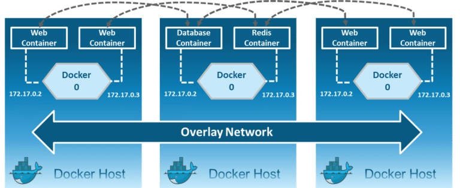

Les conteneurs individuels doivent communiquer entre eux via un réseau pour effectuer les actions nécessaires, et ce n’est rien d’autre que le **réseau Docker (Docker Networking)**.

On peut définir le **réseau Docker** comme un passage de communication grâce auquel tous les conteneurs isolés communiquent entre eux dans diverses situations pour effectuer les actions requises.

### Types des réseaux Docker

Il existe principalement **6 types de réseaux : Bridge, Host, None, Overlay, IPvlan et Macvlan**

```yaml
# Lister les types de réseaux Docker
[root@earth ~]# docker info | grep Network
Network: bridge host ipvlan macvlan null overlay

# Afficher l’interface bridge docker0 créé par défaut par le service Docker
[root@earth ~]# nmcli
...
docker0: connecté (en externe) à docker0
        "docker0"
        bridge, 06:BC:99:0D:E3:77, sw, mtu 1500
        inet4 172.17.0.1/16
        route4 172.17.0.0/16 metric 0
...
```

> **Remarque :** Le serveur Docker crée et configure l’interface **docker0** de l’hôte comme un **pont Ethernet** dans le noyau Linux, utilisé par les conteneurs Docker pour **communiquer entre eux et avec le monde extérieur**. Tous les conteneurs Docker sont connectés par défaut à **docker0**, et peuvent utiliser les règles NAT iptables créées par Docker pour communiquer avec l’extérieur.

```yaml
# Lister les réseaux Docker existants par défaut
[root@earth ~]# docker network ls
NETWORK ID          NAME      DRIVER     SCOPE
b05ff920f0da        bridge    bridge     local
f34113b7dc6a        host      host       local
ba9b9833188b        none      null       local
```

## 1- Réseau Bridge prédéfini
Le réseau **bridge** est un _**réseau interne privé prédéfini**_ créé par Docker sur l’hôte. Ainsi, tous les conteneurs obtiennent une adresse IP interne et peuvent accéder les uns aux autres via cette IP interne. Les réseaux bridge sont généralement utilisés lorsque vos applications s’exécutent dans des conteneurs autonomes qui doivent communiquer.


```yaml
# Afficher les détails du réseau "bridge prédéfini" (sous-réseau, passerelle, conteneurs attachés, etc.)
$ docker network inspect bridge

...
Driver": "bridge",
        "EnableIPv4": true,
        "EnableIPv6": false,
        "IPAM": {
            "Driver": "default",
            "Options": null,
            "Config": [
                {
                    "Subnet": "172.17.0.0/16",
                    "Gateway": "172.17.0.1"
                }
...
```
#### Exemple de l'utilisation du réeau bridge prédéfini

```yaml
# Créer et démarre un conteneur en arrière-plan avec le réseau "bridge prédéfini"
$ docker run -it --rm --name alpine1 alpine
/ ip add
2: eth0@if9: <BROADCAST,MULTICAST,UP,LOWER_UP,M-DOWN> mtu 1500 qdisc noqueue state UP 
    link/ether a2:4c:fa:fb:67:1c brd ff:ff:ff:ff:ff:ff
    inet 172.17.0.3/16 brd 172.17.255.255 scope global eth0
/ exit

# Créer et démarrer un conteneur en arrière-plan avec le réseau "bridge prédéfini"
$ docker run -itd --rm --name demo1 busybox

# Démarrer deux autres conteneurs dans le réseau "bridge prédéfini"
$ docker run -itd --rm --name demo2 busybox
$ docker run -itd --rm --name demo3 busybox

# Vérifier quels conteneurs sont connectés au réseau "bridge prédéfini"
$ docker inspect bridge
"ConfigOnly": false,
        "Containers": {
            "610621fe0acc28ecac7074ecd4c926f7590ea10a9d9a7e41d1289a070f5ce844": {
                "Name": "demo2",
                "EndpointID": "e1e3cd0afb69b4712073bbbaa6089ba6ab8f74bdf4ca336482b3e1a31fdf12cf",
                "MacAddress": "92:05:c7:e2:ba:f7",
                "IPv4Address": "172.17.0.3/16",
                "IPv6Address": ""
            },
            "91cfe2f84da4d06e534ea13b8fca6cddad6db7e146d432377c8791ecefc4634a": {
                "Name": "demo3",
                "EndpointID": "14341708beb214b16ed236c8f61b4de527acdfd8d4bf21e163f06e0ed272196b",
                "MacAddress": "26:10:81:f9:a7:8a",
                "IPv4Address": "172.17.0.4/16",
                "IPv6Address": ""
            },
            "f5e58a228a4c40a0e13a084740c4075e313213a80abf163203fe73e1b9532ed3": {
                "Name": "demo1",
                "EndpointID": "f3ad3dc259c60bb0642091718c4f12005f0367e38f551c4eeb3123dab141fa18",
                "MacAddress": "b6:05:f1:37:f2:6f",
                "IPv4Address": "172.17.0.2/16",
                "IPv6Address": ""
            }
        },

# Afficher la configuration DNS utilisée dans l'hôte
$ cat /etc/resolv.conf
nameserver 192.168.145.2
search localdomain

# Ouvrer un shell dans le conteneur demo1
$ docker exec -it demo1 sh

# Afficher les interfaces et adresses IP du conteneur
/ ip ad
2: eth0@if5: <BROADCAST,MULTICAST,UP,LOWER_UP,M-DOWN> mtu 1500 qdisc noqueue 
    link/ether b6:05:f1:37:f2:6f brd ff:ff:ff:ff:ff:ff
    inet 172.17.0.2/16 brd 172.17.255.255 scope global eth0
       valid_lft forever preferred_lft forever

# Tester la connectivité avec un autre conteneur
/ ping -c 3 172.17.0.3
PING 172.17.0.3 (172.17.0.3): 56 data bytes
64 bytes from 172.17.0.3: seq=0 ttl=64 time=0.063 ms
```

#### DNS partagé entre Hôte et réeasu bridge prédéfini

```yaml
# Afficher la configuration DNS utilisée (similaire de l'hôte)
/ cat /etc/resolv.conf
nameserver 192.168.145.2
search localdomain

# Afficher la table de routage du conteneur
/ ip route
default via 172.17.0.1 dev eth0 
172.17.0.0/16 dev eth0 scope link  src 172.17.0.2
/ exit

# Tester la résolution DNS et la connectivité Internet
/ ping -c 3 www.google.com
PING www.google.com (142.250.69.68): 56 data bytes
64 bytes from 142.250.69.68: seq=0 ttl=127 time=8.448 ms

# Arrêter et supprimer les conteneurs grâce à l’option --rm utilisée lors du démarrage
$ docker stop demo1 demo2 demo3
$ docker ps -a
```
## Réseau bridge personnalisé

#### Exemple - Création d'un nouveau réseau bridge personalisé


```yaml
# Créer un nouveau réseau bridge personalisé nommé net1
[root@earth ~]# docker network create --driver bridge --subnet=192.168.1.0/24 --gateway=192.168.1.1 net1

# Lister les réseaux Docker
[root@earth ~]# docker network ls
NETWORK ID          NAME                DRIVER              SCOPE
b05ff920f0da        bridge              bridge              local
f34113b7dc6a        host                host                local
4c7a97493cf3        net1              bridge              local
ba9b9833188b        none                null                local

# Vérifier le nouveau interface virtuel bridge
[root@earth ~]# nmcli
br-9f0de78575a2: connecté (en externe) à br-9f0de78575a2
        "br-9f0de78575a2"
        bridge, 82:5A:A7:13:59:1E, sw, mtu 1500
        inet4 192.168.1.1/24
        route4 192.168.1.0/24 metric 0

# Vérifier les détails de nouveau réseau bridge
[root@earth ~]# docker network inspect net1
    {
        "Name": "net1",
        "Id": "0f3495f1177c34e637d8091902ed7d1dd2191a8b9fe6d589c1bbf2c9adce5519",
        "Created": "2025-08-24T12:42:22.51811742-04:00",
        "Scope": "local",
        "Driver": "bridge",
        "EnableIPv4": true,
        "EnableIPv6": false,
        "IPAM": {
            "Driver": "default",
            "Options": {},
            "Config": [
                {
                    "Subnet": "192.168.1.0/24",
                    "Gateway": "192.168.1.1"
...
```

#### Exécuter des conteneurs sur le nouveau réseau bridge

```yaml
# Démarrer un conteneur app1 en utilisant le réseau net1
[root@earth ~]# docker run -it --name app1 --network net1 alpine 
/ ip ad
...
2: eth0@if12: <BROADCAST,MULTICAST,UP,LOWER_UP,M-DOWN> mtu 1500 qdisc noqueue state UP 
    link/ether 02:42:c0:a8:01:02 brd ff:ff:ff:ff:ff:ff
    inet 192.168.1.2/24 brd 192.168.1.255 scope global eth0
       valid_lft forever preferred_lft forever
	   
# Utiliser CTRL + p, puis CTRL + q pour sortir du conteneur sans l’arrêter.

# Démarrer un autre conteneur app2 sur net1 et vérifions la communication entre les deux
[root@earth ~]# docker run -it --name app2 --network net1 alpine 
/ ip ad
...
2: eth0@if10: <BROADCAST,MULTICAST,UP,LOWER_UP,M-DOWN> mtu 1500 qdisc noqueue state UP 
    link/ether 02:42:c0:a8:01:03 brd ff:ff:ff:ff:ff:ff
    inet 192.168.1.3/24 brd 192.168.1.255 scope global eth0
       valid_lft forever preferred_lft forever

# Tester ping entre app1 et app2
/ ping -c 3 192.168.1.2
PING 192.168.1.2 (192.168.1.2): 56 data bytes
64 bytes from 192.168.1.2: seq=0 ttl=64 time=0.191 ms
...
```
#### DNS Docker intégré avec les réseaux bridge créés par l'utilisateur

> **Remarque**: Les conteneurs peuvent se joindre en utilisant leurs noms. Docker a un serveur **DNS intégré 127.0.0.11**  qui permet la résolution des noms de conteneurs. Ils peuvent se connecter à l'internet aussi.

```yaml
# Tester le DNS integré
/ cat /etc/resolv.conf
nameserver 127.0.0.11
search localdomain
options ndots:0

/ ping -c 3 app1
PING app2 (192.168.1.3): 56 data bytes
64 bytes from 192.168.1.3: seq=0 ttl=64 time=0.087 ms

/ ping -c 3 www.google.com
PING www.google.com (142.250.69.68): 56 data bytes
64 bytes from 142.250.69.68: seq=0 ttl=127 time=11.729 ms
...

# Utiliser CTRL + p, puis CTRL + q pour sortir du conteneur sans l’arrêter.
```

Utilisez **`docker network inspect net1`** pour voir les conteneurs sur ce réseau et leurs adresses IP

```yaml
[root@earth ~]# docker network inspect net1
 "Containers": {
            "2ca2b7353e439a27390d363237ba166e9bb9f957748ec01455a3f17a4fc14afa": {
                "Name": "app1",
                "EndpointID": "edfcfafd5da16efe1524ce744f8dae3cec57dc7cf6e80aa922e7b28d5bcebb2a",
                "MacAddress": "02:42:ac:12:00:02",
                "IPv4Address": "192.168.1.2/24",
                "IPv6Address": ""
            },
            "c353a85a7c70ff125815f817335abb98ebffa82f595878d20074aee8ed837f74": {
                "Name": "app2",
                "EndpointID": "a2e0b13be62ae9813ed3d70d423f32031b57a3cef30eec78598684f0459cbfdd",
                "MacAddress": "02:42:ac:12:00:03",
                "IPv4Address": "192.168.1.3/24",
                "IPv6Address": ""
            }
        },
        "Options": {},
        "Labels": {}
    }
```

#### Supprimer le nouveau réseau Bridge 

```yaml
[root@earth ~]# docker network remove net1
Error response from daemon: error while removing network: network net1 id 4c7a97493cf3b2c151966afa5a933859ba6b246862f1d05ac9030d9aaa4d70ac has active endpoints

# Avant de supprimer un réseau, assurez-vous qu’aucun conteneur n’y est connecté
[root@earth ~]# docker rm -f app1 app2
app1
app2

[root@earth ~]# docker network remove net1
net1

[root@earth ~]# docker network ls
NETWORK ID          NAME                DRIVER              SCOPE
b05ff920f0da        bridge              bridge              local
f34113b7dc6a        host                host                local
ba9b9833188b        none                null                local
```

 **`docker network prune`** supprimera tous les réseaux non utilisés.


## 2- Réseau Host

Le réseau **Host** supprime l’isolation réseau entre l’hôte Docker et les conteneurs pour utiliser directement le réseau de l’hôte. Ainsi, vous ne pouvez pas exécuter plusieurs conteneurs web sur le même port de l’hôte, car le port est commun à tous les conteneurs du réseau host.


Avec le réseau **host**, le conteneur utilise directement l’interface physique de l’hôte : **pas de NAT ni de mappage de ports.**

```yaml
# Lister les réseaux disponibles.
[root@earth ~]# docker network ls
NETWORK ID     NAME        DRIVER    SCOPE
81dfee2cc1a8   bridge      bridge    local
24ca579cac93   host        host      local
5534e991653d   none        null      local

# Vérifier la configuration du réseau "host".
[root@earth ~]# docker network inspect host 
    {
        "Name": "host",
        "Id": "24ca579cac936f740ef433ec9a2ff52798003db38790dab8492676d4eec0a05f",
        "Created": "2024-01-24T16:35:47.156057512-05:00",
        "Scope": "local",
        "Driver": "host",
...

# Essayer de supprimer le réseau "host" (impossible car il est pré-défini)
[root@earth ~]# docker network rm host
Error response from daemon: host is a pre-defined network and cannot be removed
```

#### Example - Utiliser le réseau host

```yaml
# Démarrer un conteneur nginx qui utilise directement le réseau de l’hôte
[root@earth ~]# docker run --rm -d --name web1 --network host nginx

[root@earth ~]# docker ps
CONTAINER ID   IMAGE      COMMAND                  CREATED          STATUS         PORTS    NAMES
50d79130ab8c   nginx      "nginx -g 'daemon of…"   5 seconds ago    Up 4 seconds            web1          
```

Il n’y a **pas de mappage de ports** privé vers public : **c’est directement sur le réseau de l’hôte.**

```yaml
# Lister l'adresse IP de votre hôte pour l'utiliser
$ nmcli
ens160: connecté à ens160
        "VMware VMXNET3"
        ethernet (vmxnet3), 00:0C:29:08:F5:AB, hw, mtu 1500
        ip4 par défaut
        inet4 172.16.130.6/24

```

Ouvrez un navigateur Web et accédez à **l’adresse IP de votre hôte Docker :**


## 3- Réseau MACvlan

**MACvlan** est un réseau Docker qui permet d’attribuer **à chaque conteneur sa propre adresse MAC unique**, comme s’il s’agissait d’un véritable périphérique physique (un PC ou un serveur) connecté au réseau.

- Concrètement, le conteneur **apparaît directement sur le réseau local (LAN)**, avec ses **propres adresse MAC et adresse IP**.
- Aux yeux du routeur ou du switch du réseau, **chaque conteneur ressemble donc à une machine physique indépendante**.

Cela en fait le meilleur choix dans les cas suivants :
- Lorsque vos conteneurs doivent être **accessibles directement depuis le réseau physique**, comme des serveurs classiques.
- Lorsque vous voulez **éviter les couches intermédiaires (bridge ou NAT)** et garantir des performances réseau plus proches du matériel.


#### Example - Création du réseau MACvlan

```yaml
#  Identifier l’interface parente, l’IP et la passerelle de l’hôte (ex: enp0s3) pour pouvoir créer le réseau macvlan
$ nmcli 
enp0s3: connecté à enp0s3
		ethernet, 00:0C:29:08:F5:AB, hw, mtu 1500
		ip4 par défaut
		inet4 10.7.1.232/24
		route4 10.7.1.0/24 metric 100
		route4 default via 10.7.1.2 metric 100
		
# Créer le réseau macvlan en réutilisant le même sous-réseau et la même passerelle de l'interface de l'hôte
$ docker network create -d macvlan --subnet 10.7.1.0/24 --gateway 10.7.1.2 -o parent=enp0s3 macvlan1

# Vérifier que macvlan1 a été créé
$ docker network ls
NETWORK ID     NAME       DRIVER    SCOPE
6b7447039910   bridge     bridge    local
f0230dc47a4e   host       host      local
829fffc0d9df   macvlan1   macvlan   local
7030aff8c1aa   none       null      local
```

#### Exécuter des conteneurs sur le réseau MACvlan

```yaml
# Lancer un conteneur avec une IP spécifique du même réseau macvlan1
$ docker run -it --rm --name demo1 --network macvlan1 --ip 10.7.1.200 busybox

# Vérifier son adresse MAC et IP
/ ip ad 
22: eth0@if2: <BROADCAST,MULTICAST,UP,LOWER_UP,M-DOWN> mtu 1500 qdisc noqueue
    link/ether ce:03:3e:9b:f9:bf brd ff:ff:ff:ff:ff:ff
    inet 10.7.1.200/24 brd 10.7.1.255 scope global eth0
	   
# Tester la connectivité avec la passerelle par défaut
/ ping -c 3 10.7.1.2
PING 10.7.1.2 (10.7.1.2): 56 data bytes
64 bytes from 10.7.1.2: seq=0 ttl=128 time=1.049 ms

# Tester la connectivité avec Internet 
/ ping -c 3 www.google.com
PING www.google.com (142.250.69.68): 56 data bytes
64 bytes from 142.250.69.68: seq=0 ttl=128 time=8.959 ms

# Utiliser CTRL + p, puis CTRL + q pour sortir du conteneur sans l’arrêter.

# Lancer un second conteneur sur macvlan
$ docker run -it --rm --name demo2 --network macvlan1 --ip 10.7.1.201 busybox

# Comparer les adresses MAC des deux conteneurs.
/ ip ad 
19: eth0@if2: <BROADCAST,MULTICAST,UP,LOWER_UP,M-DOWN> mtu 1500 qdisc noqueue
    link/ether ce:03:3e:9b:f9:bf brd ff:ff:ff:ff:ff:ff
    inet 10.7.1.201/24 brd 10.7.1.255 scope global eth0

# Tester la communication entre conteneurs
/ ping 10.7.1.200
PING 10.7.1.200 (10.7.1.200): 56 data bytes
64 bytes from 10.7.1.200: seq=0 ttl=128 time=1.049 ms

# Tester la connectivité avec Internet 
/ ping -c 3 www.google.com
PING www.google.com (142.250.69.68): 56 data bytes
64 bytes from 142.250.69.68: seq=0 ttl=128 time=8.959 ms

# Utiliser CTRL + p, puis CTRL + q pour sortir du conteneur sans l’arrêter.

# Vérifier la configuration du réseau macvlan
$ docker inspect macvlan1
 "ConfigOnly": false,
        "Containers": {
            "2fa4dcce44e4b54129cfd59a2608310964a3aeafa24ed89fa9e08017524a2a90": {
                "Name": "demo2",
                "EndpointID": "139b894b6912f0c58955976de78ac805c67677e909c39a3d3f1200e535bf7f40",
                "MacAddress": "b6:9c:4e:30:dd:62",
                "IPv4Address": "192.168.145.201/24",
                "IPv6Address": ""
            },
            "d15b02111a90accdd465eb4a69d06d11967d5d34fa43d79e07c3ac8661e22d99": {
                "Name": "demo1",
                "EndpointID": "82ae2dbdb988c3b9f585c43e6595357a71791bea27be90dc3edd79c0cd84562e",
                "MacAddress": "6a:77:af:7a:16:67",
                "IPv4Address": "192.168.145.200/24",
                "IPv6Address": ""
            }
        },

# Arrêter et supprimer les deux conteneurs
$ docker rm -f demo1 demo2
```

#### Supprimer le réseau MACvlan

```yaml
# Supprimer le réseau macvlan
$ docker network rm macvlan1

# Vérifier qu'il a été supprimé
$ docker network ls
```

## 4- Réseau IPvlan

**IPvlan** est un mode réseau dans lequel chaque conteneur reçoit **sa propre adresse IP (IPv4/IPv6)**, mais **partage l’adresse MAC de l’interface parente (en mode L2)**, ou bien est **routé derrière l’interface parente (en mode L3)**.

### IPvlan L2 (couche 2)

- Tous les paquets sortent avec **la même adresse MAC (celle du parent)**.
- Chaque conteneur a **son IP dans le même sous-réseau que l’interface parente**.
- Utile quand l’infrastructure **n’autorise pas plusieurs MAC sur le même port** (Wi-Fi, VMware avec politiques strictes, certains clouds).
- Limitation : comme avec macvlan, le trafic hôte ↔ conteneur n’est pas direct par défaut (contournable en créant une interface ipvlan côté hôte).


#### Example - Création d'un réseau IPvlan (Layer 2)

```yaml
# Identifier l’interface parente, l’IP et la passerelle de l’hôte (ex: enp0s3) pour pouvoir créer le réseau ipvlan (L2)
# Prener en note l'adresse MAC de l'interface pour le comparer avec les adresses MAC des conteneurs créés
$ nmcli 
enp0s3: connecté à enp0s3
		ethernet, 00:0C:29:08:F5:AB, hw, mtu 1500
		ip4 par défaut
		inet4 10.7.1.232/24
		route4 10.7.1.0/24 metric 100
		route4 default via 10.7.1.2 metric 100
		
# Créer un réseau ipvlan en mode Layer 2 (même MAC que l’hôte)
$ docker network create -d ipvlan --subnet 10.7.1.0/24 --gateway 10.7.1.2 -o parent=enp0s3 ipvlan1

# Vérifier sa création
$ docker network ls

# Lancer un conteneur attaché au réseau ipvlan
$ docker run -it --rm --name demo1 --network ipvlan1 --ip 10.7.1.200 busybox

# Comparer son adresse MAC avec celle de l’hôte (similaire)
/ ip ad 
12: eth0@if2: <BROADCAST,MULTICAST,UP,LOWER_UP,M-DOWN> mtu 1500 qdisc noqueue
    link/ether 00:0c:29:08:f5:ab brd ff:ff:ff:ff:ff:ff
    inet 192.168.145.200/24 brd 192.168.145.255 scope global eth0

# Tester la connectivité
/ ping -c 3 www.google.com
PING www.google.com (142.250.69.68): 56 data bytes
64 bytes from 142.250.69.68: seq=0 ttl=128 time=8.959 ms

# Utiliser CTRL + p, puis CTRL + q pour sortir du conteneur sans l’arrêter.

# Vérifier la configuration du réseau ipvlan (L2)
$ docker inspect ipvlan1
 "ConfigOnly": false,
        "Containers": {
            "a28a2d74a5917d23b966f026a71ffa344b2cb45a4d094866de3c30a7360ef643": {
                "Name": "demo1",
                "EndpointID": "4a595656aada99509561678baebc648f5fe37c8f2690d94a2a4790b3acfd981c",
                "MacAddress": "",
                "IPv4Address": "192.168.145.200/24",
                "IPv6Address": ""
            },
			
# Arrêter et supprimer le conteneur
$ docker rm -f demo1
```

#### Supprimer le réseauIPvlan (L2)

```yaml
# Supprimer le réseau ipvlan
$ docker network rm ipvlan1

# Vérifier sa suppression
$ docker network ls
```

### IPvlan L3 (couche 3)

- Les conteneurs sont dans **un (ou plusieurs) sous-réseaux différents de celui du parent**.
- **L’hôte** se comporte comme **un routeur pour ces sous-réseaux**.
- Pour que l’extérieur atteigne directement ces conteneurs, il faut **ajouter des routes sur le routeur** ou faire du NAT sur l’hôte.


#### Example - Création d'un réseau IPvlan (Layer 3)

```yaml
# Créer un réseau ipvlan en mode Layer 3 avec deux sous-réseaux
$ docker network create -d ipvlan --subnet 192.168.94.0/24 --subnet 192.168.95.0/24 -o parent=enp0s3 -o ipvlan_mod=l3 ipvlan2

# Vérifier sa création
$ docker network ls

# Lancer un conteneur dans le 1er sous-réseau
$ docker run -it --rm --name demo1 --network ipvlan2 --ip 192.168.94.7 busybox

# Vérifier son IP
/ ip ad 
30: eth0@if2: <BROADCAST,MULTICAST,UP,LOWER_UP,M-DOWN> mtu 1500 qdisc noqueue
    link/ether 00:0c:29:08:f5:ab brd ff:ff:ff:ff:ff:ff
    inet 192.168.94.7/24 brd 192.168.94.255 scope global eth0
	
# Utiliser CTRL + p, puis CTRL + q pour sortir du conteneur sans l’arrêter.

# Lancer un conteneur dans le 2e sous-réseau
$ docker run -it --rm --name demo2 --network ipvlan2 --ip 192.168.95.7 busybox

# Vérifier son IP
/ ip ad
31: eth0@if2: <BROADCAST,MULTICAST,UP,LOWER_UP,M-DOWN> mtu 1500 qdisc noqueue
    link/ether 00:0c:29:08:f5:ab brd ff:ff:ff:ff:ff:ff
    inet 192.168.95.7/24 brd 192.168.95.255 scope global eth0
       valid_lft forever preferred_lft forever
	   
# Constater que le ping échoue car il n'y a pas de routage entre sous-réseaux
/ ping 192.168.94.7 # Ne fonctionnera pas

/ ping 8.8.8.8 # Ne fonctionnera pas

# Utiliser CTRL + p, puis CTRL + q pour sortir du conteneur sans l’arrêter

# Vérifier la configuration du réseau ipvlan
$ docker inspect ipvlan2  
"Containers": {
            "2ec42157db2ac5ed396f8d707be0a21ca6dc16939bd06385a0c69d10661348b7": {
                "Name": "demo1",
                "EndpointID": "6c4209cb6251085d3dd4f11c0914a958a6be2a7188bdd64f89b7b60e82beeaae",
                "MacAddress": "",
                "IPv4Address": "192.168.94.7/24",
                "IPv6Address": ""
            },
            "835345e08c6cd0d662b90c1ffc9deb7e0a4fa9d3e8f16c726e5ec105053ee399": {
                "Name": "demo2",
                "EndpointID": "f6804575d065254360044337446cc936092762fa5a47ee288a892c1e3aee350d",
                "MacAddress": "",
                "IPv4Address": "192.168.95.7/24",
                "IPv6Address": ""
            }

```

#### Routage entre les deux sous-réseaux

- Le trafic entre sous-réseaux n’est pas automatique. Des conteneurs dans 192.168.94.0/24 n’atteindront pas 192.168.95.0/24 par défaut.
- Il faut **créer des routes statiques** pour connecter ces sous-réseaux.
- L’accessibilité **externe** à ces sous-réseaux exige également des routes.

#### Supprimer le réseauIPvlan (L3)

```yaml
# Arrêter et supprimer les deux conteneurs
$ docker rm -f demo1 demo2

# Supprimer le réseau
$ docker network rm ipvlan2

# Vérifier sa suppression.
$ docker network ls
```

## 5- Réseau Overlay

**Overlay** crée un réseau interne privé qui s’étend sur tous les nœuds du cluster **Docker Swarm**. Les réseaux overlay facilitent la communication entre un service swarm et un conteneur autonome, ou entre deux conteneurs autonomes sur différents démons Docker.



> **Remarque :** Comme nous utilisons Docker-CE, il n’y a pas de réseau Overlay. 

## 6- Réseau None (null)

Dans ce type de réseau, les conteneurs ne sont connectés à aucun réseau et **n’ont aucun accès au réseau externe ni aux autres conteneurs**. Ce réseau est utilisé lorsque vous souhaitez désactiver complètement la pile réseau d’un conteneur et créer uniquement une interface loopback.


#### Example - Création d'un conteneur sans réseau

```yaml
# Lancer un conteneur sans aucune interface réseau.
$ docker run -it --rm --name demo1 --network none busybox

# Constater qu’il n’y a pas de carte réseau ni d’adresse IP.
/ ip ad 
1: lo: <LOOPBACK,UP,LOWER_UP> mtu 65536 qdisc noqueue qlen 1000
    link/loopback 00:00:00:00:00:00 brd 00:00:00:00:00:00
    inet 127.0.0.1/8 scope host lo
       valid_lft forever preferred_lft forever
    inet6 ::1/128 scope host
       valid_lft forever preferred_lft forever
/ exit
```

## Résumé

|Bridge|Host|IPvlan|Macvlan|Overlay|None
|---|---|---|---|---|---|
|Connecte le conteneur au LAN et aux autres conteneurs|Supprime l’isolation réseau entre le conteneur et l’hôte|Associé à une interface Ethernet Linux|Assigne une adresse MAC, apparaît comme un hôte physique|Connecte plusieurs hôtes Docker et leurs conteneurs et active le swarm|Connecte le conteneur à un réseau isolé avec uniquement ce conteneur|
|Type de réseau par défaut|Un seul conteneur peut utiliser un port à la fois|Assure la séparation entre les réseaux et la connectivité au réseau physique.|Clone les interfaces hôte pour créer des interfaces virtuelles, disponibles dans le conteneur.|Disponible uniquement avec Docker EE et Swarm activé.|Le conteneur ne peut communiquer avec aucun autre réseau ni périphérique réseau.|
|Excellent pour la plupart des cas|Utile pour des applications spécifiques, comme un conteneur de gestion que vous voulez exécuter sur chaque hôte|Offre un certain nombre de fonctionnalités uniques et beaucoup de place pour des innovations avec divers modes.|Prend en charge la connexion aux VLANs|Réseau multi-hôte utilisant VXLAN|

---
Ressources:

_https://docs.docker.com/network/_


