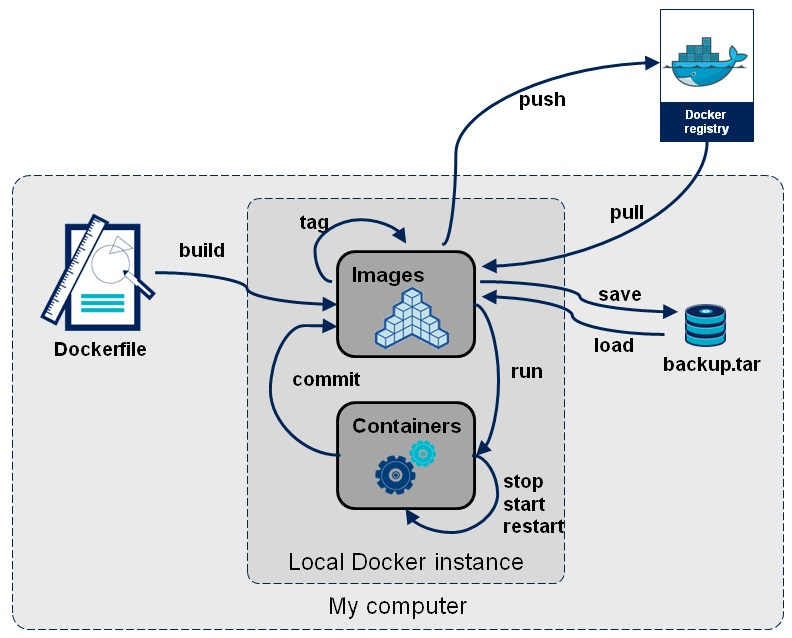
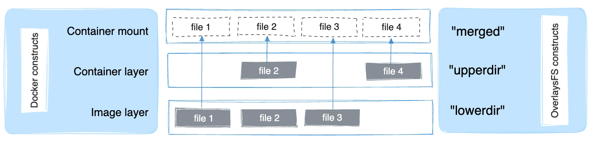
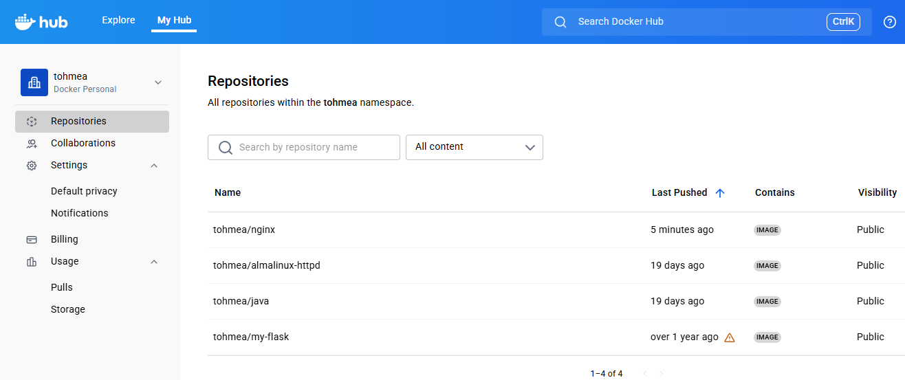

## Qu'est-ce qu'une image Docker ?

Une image est un paquet exécutable qui inclut tout ce qui est nécessaire pour exécuter une application : le code, un environnement d’exécution, des bibliothèques, des variables d’environnement et un fichier de configuration.

> Un conteneur est une instance d’exécution d’une image.



### Comprendre le concept de couches avec les images Docker

- **Plusieurs conteneurs** sont généralement basés sur la **même image.**
- Les images sont composées de **plusieurs couches en lecture seule.** 
- Lorsqu’un conteneur démarre, **Docker ajoute une nouvelle couche en écriture au-dessus de l’image.**
- Cette **couche en écriture est supprimée lorsque le conteneur est supprimé.**
- Les couches sont **partagées entre les conteneurs** afin d’économiser de l’espace disque.
- Chaque conteneur démarre comme s’il avait une copie neuve de l’image, **mais sans réellement la copier.**

#### Pourquoi pas de copies ?

- Les images de conteneur **peuvent être très volumineuses**, comme l’image Anaconda Python qui fait environ 1,5 Go.
- Faire une copie serait à la fois **un gaspillage d’espace disque et très lent.**
- Docker n’effectue donc pas de copies, il utilise plutôt une **technique de superposition appelée `Overlay filesystem`.**

#### Comment fonctionne le système de fichiers Overlay (OverlayFS) ?

**`OverlayFS`** monte un système de fichiers en utilisant deux répertoires : un **`lower directory`** et un **`upper directory`**.

- **`lower directory`** pour l’image en **lecture seule**.
- **`upper directory`** pour la couche du conteneur en **lecture/écriture**.
- Vous les voyez fusionnés comme s’il s’agissait d’un seul dossier appelé **merged**.

Le schéma suivant montre comment une image Docker et un conteneur Docker sont organisés en couches. 



- `file1` et `file3` ne sont pas modifiés, ils restent donc dans le lowerdir.
- `file2` a été modifié (copie depuis lowerdir).
- `file4` existe dans upperdir car il a été créé directement dans le conteneur.

### Emplacement de stockage des images et conteneurs Docker <a id="the-storage-location-of-docker-images-and-containers"></a>

Un conteneur Docker se compose de paramètres réseau, de volumes et d’images. L’emplacement des fichiers Docker dépend de votre système d’exploitation. 

Voici un aperçu des plus utilisés :

* Linux : `/var/lib/docker/`
* Windows : `C:\ProgramData\DockerDesktop`
* MacOS : `~/Library/Containers/com.docker.docker/Data/vms/0/`

Utilisez la commande `docker info | grep Root` pour le trouver :

```console
[root@earth]# docker info | grep Root
Docker Root Dir: /var/lib/docker
```
### Rechercher une image

Que vous utilisiez un registre public ou privé, vous pouvez rechercher dans ce registre l’image dont vous avez besoin. 
C’est ce que fait la commande docker search

```yaml
docker search [OPTIONS] TERM
```

`docker search` a des options de filtrage très utiles, vous pouvez filtrer les résultats selon ces conditions :

* **stars=_Nombre_des_étoiles_**
* **is-automated=\(true\|false\)**
* **is-official=\(true\|false\)**

```console
[root@earth]# docker search --filter "stars=90" --filter "is-official=true" ubuntu
NAME                DESCRIPTION                                     STARS               OFFICIAL            AUTOMATED
ubuntu              Ubuntu is a Debian-based Linux operating sys…   11152               [OK]                
ubuntu-upstart      Upstart is an event-based replacement for th…   110                 [OK]
```

### Lister les images

Pour lister les images locales, utilisez la syntaxe suivante :

```console
[root@earth]# docker image ls
REPOSITORY          TAG                 IMAGE ID            CREATED              SIZE
<none>              <none>              fc32da11d651        About a minute ago   233MB
redis               latest              50541622f4f1        4 days ago           104MB
ubuntu              latest              adafef2e596e        2 weeks ago          73.9MB
nginx               latest              9beeba249f3e        2 months ago         127MB
hello-world         latest              bf756fb1ae65        6 months ago         13.3kB
```

L’image que nous avons récemment construite apparaît sur la première ligne. 
Nous ne l’avons pas étiquetée lors du processus de construction, nous parlerons du tagging plus loin.

### Télécharger une image depuis le registre par défaut

Pour télécharger une image spécifique ou un ensemble d’images, utilisez `docker pull :`

```yaml
docker pull <image name>
```

```console
[root@earth]# docker pull python
Using default tag: latest
latest: Pulling from library/python
15b1d8a5ff03: Already exists 
22718812f617: Pull complete 
401a98f7495b: Pull complete 
ad446e7df19a: Pull complete 
5d32990caa16: Pull complete 
a79d633abf9a: Pull complete 
249a56c8e466: Pull complete 
Digest: sha256:2deb0891ec3f643b1d342f04cc22154e6b6a76b41044791b537093fae00b6884
Status: Downloaded newer image for python:latest
docker.io/library/python:latest

```

> Note: Comme mentionné, les images Docker peuvent être composées de plusieurs couches. Dans l’exemple ci-dessus, l’image en **contient six couches**.

### Supprimer une ou plusieurs images spécifiques

Utilisez la commande `docker images` pour localiser l’ID des images que vous souhaitez supprimer. Ensuite, utilisez `docker rmi` en spécifinat leur ID ou tag:

```yaml
docker rmi <image1> <image2>
```

```console
[root@earth]# docker rmi ubuntu
Untagged: ubuntu:latest
Untagged: ubuntu@sha256:9cbed754112939e914291337b5e554b07ad7c392491dba6daf25eef1332a22e8
Deleted: sha256:802541663949fbd5bbd8f35045af10005f51885164e798e2ee8d1dc39ed8888d
Deleted: sha256:9d592720ced4a7a4ddf16adef8a126e4c8c49f22114de769343320b37674321e
```

> Vous ne pouvez pas supprimer une image utilisée par un conteneur arrêté, sauf en utilisant **`-f`**.

```console
[root@earth]# docker rmi python:latest 
Error response from daemon: conflict: unable to remove repository reference "python:latest" (must force) - container 88347b61e797 is using its referenced image 77f2b24be2b3

[root@earth]# docker ps -a
CONTAINER ID   IMAGE           COMMAND     CREATED          STATUS                    PORTS     NAMES
88347b61e797   python:latest   "python3"   56 seconds ago   Exited (0)55 seconds ago            python1

[root@earth]# docker rmi -f python:latest
Untagged: python:latest
Untagged: python@sha256:2deb0891ec3f643b1d342f04cc22154e6b6a76b41044791b537093fae00b6884
Deleted: sha256:77f2b24be2b3987f6d59918787d226acb4e6612644bacb3dd37adc494e477d9e
```

### Taguer les images

- En termes simples, les tags Docker ajoutent des informations utiles sur une version/variante spécifique de l’image.
- Ce sont des **`alias`** vers l’ID de votre image.

Les deux cas les plus fréquents où les tags sont utilisés :

1. Lors de la construction d’une image :

```yaml
docker build -t image_name:tag_name .
```
Cela indique au démon Docker d’aller chercher le fichier Docker présent dans le répertoire courant (c’est ce que fait le `.` à la fin). 
Ensuite, on demande au démon Docker de construire l’image et de lui attribuer le tag spécifié.

2. En utilisant la commande `docker tag` :

```yaml
docker tag SOURCE_IMAGE[:TAG] TARGET_IMAGE[:TAG]
```

Cela crée simplement un alias (une référence) sous le nom de `TARGET_IMAGE` qui pointe vers `SOURCE_IMAGE`. 

```console
[root@earth]# docker image ls
python              latest              45fd9a3ce5de        13 days ago         1.11GB
ubuntu              latest              adafef2e596e        2 weeks ago         73.9MB
nginx               latest              9beeba249f3e        2 months ago        127MB
...
[root@earth]# docker tag python:latest python:original
[root@earth]# docker image ls
REPOSITORY          TAG                 IMAGE ID            CREATED             SIZE
python              original            45fd9a3ce5de        13 days ago         1.11GB
ubuntu              latest              adafef2e596e        2 weeks ago         73.9MB
nginx               latest              9beeba249f3e        2 months ago        127MBMB
```

Si aucun tag n’est spécifié, Docker utilise *`:latest`* par défaut.

### Valider des modifications dans une image (Commit)

Lorsque vous travaillez avec des images et des conteneurs Docker, l’une des fonctionnalités de base consiste à valider des modifications dans une image Docker. 
Quand vous validez des modifications, vous créez essentiellement une nouvelle image avec une couche supplémentaire qui modifie la couche de base de l’image.

```yaml
docker commit [OPTIONS] CONTAINER [REPOSITORY[:TAG]]
```

Par exemple, exécutons un conteneur basé sur l’image `nginx` :

```console
[root@earth]# docker run -d -p 8080:80 --name nginx1 nginx
63c8886ceb5cce637348a75fd3deaeee36d8deb67bd327d58657f8133f557689
```

Maintenant attachons-nous au conteneur et modifions `index.html` :

```console
[root@earth]# docker exec -it nginx1 bash
root@5b0dbe546af1:/# cd /usr/share/nginx/html/
root@5b0dbe546af1:/usr/share/nginx/html# ls
50x.html    index.html
root@5b0dbe546af1:/usr/share/nginx/html# echo "<h1>NGINX Antoine Tohme</h1>" > index.html
root@5b0dbe546af1:/usr/share/nginx/html# exit
```

Créons une nouvelle image à partir de ce conteneur en cours d’exécution avec la commande **docker commit** :

```console
[root@earth]# docker commit nginx1 tohmea/nginx:1.0
sha256:39bf0253324e0e814660de517556ba5287f840a98fabf2a46db3420b55416c8d
```
> **Note**: J'ai utilisé **`tohmea`** car c'est mon nom d'utilisateur sur **Docker hub**

Voyons le résultat :

```console
[root@earth]# docker image ls
REPOSITORY            TAG       IMAGE ID       CREATED         SIZE
tohmea/nginx   1.0       39bf0253324e   7 seconds ago   54MB
```

### Publier des images dans un registre Docker

Un **registre Docker** est une application sans état, hautement évolutive, qui stocke et vous permet de distribuer des images Docker. 
Les registres peuvent être locaux (privés) ou dans le cloud (privés ou publics).

Exemples de registres Docker : **Docker Hub** [Registre par défaut]

La première chose à retenir est que chaque fois que vous utilisez un registre, vous devez d’abord vous y connecter :

> Vous devez d’abord créer un compte sur Docker Hub.

```yaml
[root@earth]# docker login -u tohmea

i Info → A Personal Access Token (PAT) can be used instead.
         To create a PAT, visit https://app.docker.com/settings
         
         
Password: 

WARNING! Your credentials are stored unencrypted in '/root/.docker/config.json'.
Configure a credential helper to remove this warning. See
https://docs.docker.com/go/credential-store/

Login Succeeded
```

Utilisez `docker push` pour envoyer une image ou un dépôt vers un registre :

```yaml
docker push [OPTIONS] NAME[:TAG]
```
Exemple:

```yaml
# Publier l'image dans Docker Hub
[root@earth]# docker push tohmea/nginx:1.0
The push refers to repository [docker.io/tohmea/nginx]
7a5cd363b2aa: Preparing 
45c2d10807fb: Preparing 
129b375526fc: Preparing 
a0e5983a25a5: Preparing 
2988603ca264: Preparing 
39bc11fab520: Waiting 
dab69e9f41e9: Waiting 
eb5f13bce993: Waiting 
1.0: digest: sha256:a6ebce1476484145a4d280d915ce18c0e0b5d6d60fbf1fd324bdc5d5f75b278e size: 1985
```



Et lorsque vous avez terminé, déconnectez-vous :

```yaml
[root@earth]# docker logout
Removing login credentials for https://index.docker.io/v1/
```

### Sauvegarder et restaurer des images

Pour **sauvegarder** une image Docker localement en tant qu’archive `tar` après l’avoir téléchargée, validée ou construite, utilisez la commande **`docker save`**. Par exemple, sauvegardons une copie locale de l’image `tohmea/nginx` :

```yaml
# Suvegarder l'images dans un fichier .tar
[root@earth]# docker save tohmea/nginx > tohmea-nginx.tar
[root@earth]# ls
tohmea-nginx.tar
```

Pour **restaurer** cette image Docker à partir du fichier tar archivé ultérieurement, utilisez la commande **`docker load`** :

```yaml
# Supprimer l'image pour tester la restauration
[root@earth]# docker rmi tohmea/nginx:1.0
[root@earth]# docker image ls

# Restaurer l'image à partir du fichier .tar
[root@earth]# docker load --input tohmea-nginx.tar  
Loaded image: tohmea/nginx:1.0
[root@earth]# docker image ls
REPOSITORY        TAG        IMAGE ID       CREATED          SIZE
tohmea/nginx      1.0        e3c264db09c0   10 minutes ago   192MB
...
```
---
References: 

https://docs.docker.com/storage/storagedriver/overlayfs-driver/

https://www.digitalocean.com/community/tutorials/how-to-remove-docker-images-containers-and-volumes

